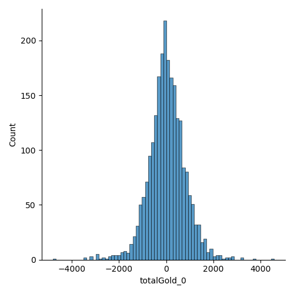

# Zilean

[](https://doi.org/10.5281/zenodo.6596322)

This projects aims to predict [League of Legends](https://www.leagueoflegends.com) 5v5 Ranked Solo match results using snapshots of game stats before the 16 minute mark

Zilean is a League of Legends character that can drift through past, present and future. We are borrowing Zilean's temporal magic to foresee the result of a match.

## Introduction

Zilean is a data analysis project with an accompanying python package. The project aims to reach high accuracy prediciting the outcome of a League of Legends 5v5 Ranked Solo high elo match in KR server. From the prediciton, draw insights on the factors that have significant impacts on the result of a match.

Here is a quick look of how to do data analysis with `zilean`

```python
import zilean
from zilean.snapshots import SnapShots
import pandas as pd

# Before any analysis, you need to have data!
# You can checkout the data I crawled by following the Zenodo link.
# Or, you can crawl your own by exploring the Riot API. The object we need is
# the MatchTimelineDto.

# Create our SnapShots object.
# We will look at the player statistics at 10 and 15 minute mark.
snaps = SnapShots("data/matches_cleaned.json", frames=[10, 15])

# View summary statistics using pandas DataFrame
sum_stat = snaps.summary()
pd.DataFrame(sum_stat)

...

# The above DataFrame is structured to have one match per row.
# We can have one frame of each match per row (thus different frames 
# from the same match will be independent from other).
sum_stat_per_frame = snaps.summary(per_frame=True)
df = pd.DataFrame(sum_stat_per_frame) 

# Look at the distribution of totalGold difference for `player 0` (TOP player)
# at 15 minutes mark.

sns.displot(x="totalGold_0", data=data[data['frame'] == 15], hue="win")
```



We can save both DataFrames to disk so we don't need to load and unpack the `MatchTimelineDto`s everytime.

```python
# Save the DataFrames to disk
snaps.to_disk()
```

Here is an example of some quick modelling.

```python
# Do some simple modelling
from sklearn.model_selection import train_test_split
from sklearn.ensemble import RandomForestClassifier

# Define X and y for training data
train, test = train_test_split(sum_stat_per_frame, test_size=0.33)
X_train = train.drop(["matchId", "win"], axis=1)
y_train = train["win"].astype(int)

# Build a default random forest classifier
rf = RandomForestClassifier()
rf.fit(X_train, y_train)
y_fitted = rf.predict(X_train)
print(f"Training accuracy: {mean(y_train == y_fitted)}")
```

## Data

The data is collected using the official [Riot API](https://developer.riotgames.com/apis) with the help from the python package [Riot-Watcher](https://github.com/pseudonym117/Riot-Watcher). To view the data, please visit [Zenodo](https://doi.org/10.5281/zenodo.6596322). 

The dataset contains information about all League of Legends KR server challengers (n=300) as of 2022-05-23. The account information is stored in `accounts.json`, whereas the information about the challenger league is in `kr_challenger_league.json`. 

Match data was retrieved from the 5 most recent 5v5 ranked solo matches for each challenger account. There are in total 2489 unique matches, and the information is stored in `matches.json`. The matches are further cleaned only to include games that last more than 16 minutes (n=2378), which are stored in `matches_cleaned.json`.