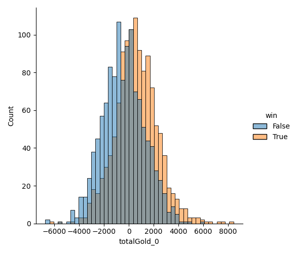

# zilean

[](https://badge.fury.io/py/zilean) [](https://codecov.io/gh/JohnsonJDDJ/zilean) [](https://zilean.readthedocs.io/en/v0.0.2/?badge=v0.0.2) [](https://mybinder.org/v2/gh/JohnsonJDDJ/zilean/HEAD?labpath=examples%2Fexamples.ipynb)

> _Zilean is a League of Legends character that can drift through past, present and future. The project is borrowing Zilean's temporal magic to foresee the result of a match._

Documentation: [here](https://zilean.readthedocs.io/).

**The project is open to all sorts of contribution and collaboration! Please feel free to clone, fork, PR...anything! If you are interested, contact me!**

Contact: Johnson Du <johnsondzh@gmail.com>

[Introduction](#Introduction)\
[Demo](#Demo)

## Introduction

`zilean` is designed to facilitate data analysis of the Riot [MatchTimelineDto](https://developer.riotgames.com/apis#match-v5/GET_getTimeline). The `MatchTimelineDto` is a powerful object that contains information of a specific [League of Legends](https://leagueoflegends.com/) match at **every minute mark**. Naturally, the `MatchTimelineDto` became an **ideal object for various machine learning tasks**. For example, predicting match results using game statistics before the 16 minute mark.

Different from traditional sports, esports such as League of Legends has an innate advantage with respect to the data collection process. Since every play was conducted digitally, it opened up a huge potential to explore and perform all kinds of data analysis. `zilean` hopes to explore the infinite potentials provided by the [Riot Games API](https://developer.riotgames.com/), **and through the power of computing, make our community a better place.**

GL:HF!

## Demo

Here is a quick look of how to do League of Legends data analysis with `zilean`

```python
from zilean import TimelineCrawler, SnapShots, read_api_key
import pandas as pd

# Use the TimelineCrawler to fetch `MatchTimelineDto`s 
# from Riot. The `MatchTimelineDto`s have game stats 
# at each minute mark.

# We need a API key to fetch data. See the Riot Developer
# Portal for more info.
api_key = read_api_key(you_api_key_here)
# Crawl 2000 Diamond RANKED_SOLO_5x5 timelines from the Korean server.
crawler = TimelineCrawler(api_key, region="kr", 
                          tier="DIAMOND", queue="RANKED_SOLO_5x5")
result = crawler.crawl(2000, match_per_id=30, file="results.json")
# This will take a long time!

# We will look at the player statistics at 10 and 15 minute mark.
snaps = SnapShots(result, frames=[10, 15])

# Store the player statistics using in a pandas DataFrame
player_stats = snaps.summary(per_frame=True)
data = pd.DataFrame(player_stats) 

# Look at the distribution of totalGold difference for `player 0` (TOP player)
# at 15 minutes mark.
sns.displot(x="totalGold_0", data=data[data['frame'] == 15], hue="win")
```



Here is an example of some quick machine learning.

```python
# Do some simple modelling
from sklearn.model_selection import train_test_split
from sklearn.ensemble import RandomForestClassifier

# Define X and y for training data
train, test = train_test_split(player_stats, test_size=0.33)
X_train = train.drop(["matchId", "win"], axis=1)
y_train = train["win"].astype(int)

# Build a default random forest classifier
rf = RandomForestClassifier()
rf.fit(X_train, y_train)
y_fitted = rf.predict(X_train)
print(f"Training accuracy: {mean(y_train == y_fitted)}")
```
